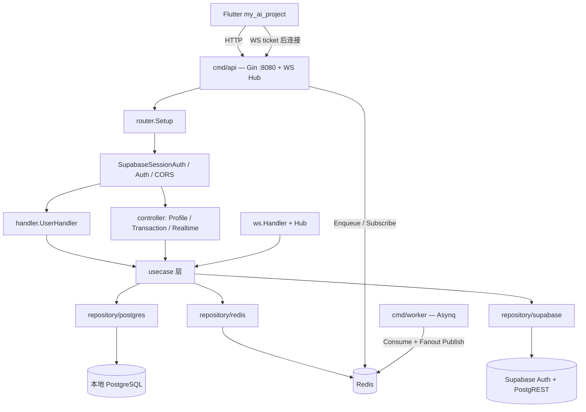
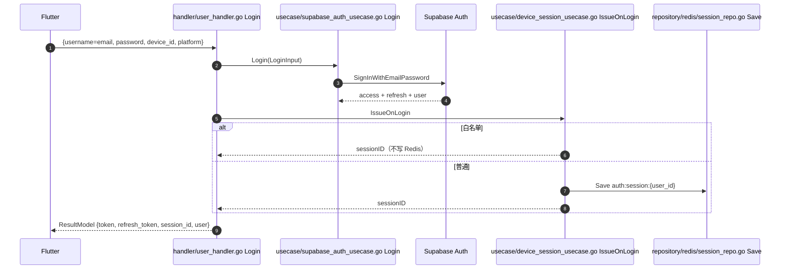
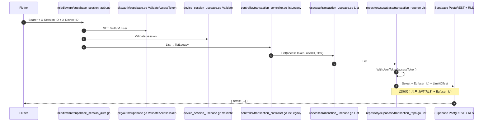
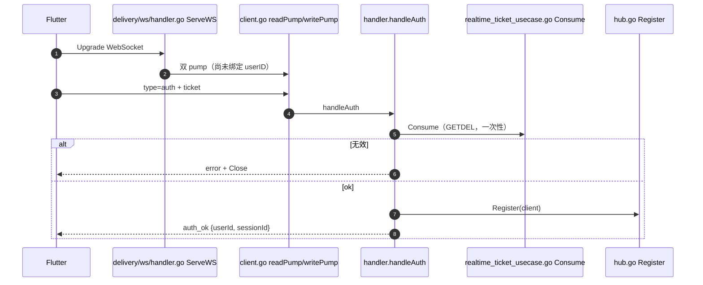

# my_go_study 架构学习指南

> 面向快速学习 Go 后端。基于本仓库真实代码梳理：**定位、分层、优缺点、三条竖切时序（认证 / Transactions / Realtime）**。  
> Git 为真相源；本文可经 `lark-cli` 同步到飞书知识库。  
> 更新日期：2026-07-20

---

## 1. 一句话定位

本仓是面向 Flutter 客户端（`my_ai_project`）的 **BFF（Backend for Frontend）**，不是全量业务库单体。

```text
my_ai_project (Flutter)
    │  HTTP JSON / WebSocket
    ▼
my_go_study (Gin BFF :8080)     ← 你在这里
    │  Auth 编排 / PostgREST / Redis / Asynq
    ▼
Supabase Cloud（Auth + PostgreSQL + RLS）
```

| 角色 | 说明 |
|------|------|
| 业务数据真相 | Supabase Postgres + RLS |
| 本仓职责 | 鉴权编排、HTTP/WS 网关、单设备 session、异步推送 |
| 本地 Postgres | 主要承载遗留 `users`（及部分未接线死代码） |
| Redis | session / WS ticket / presence / 事件序 / Pub/Sub |

技术栈：Go 1.22 · Gin · GORM · Redis · Supabase（gotrue + PostgREST）· Asynq。

---

## 2. 目录与分层

```text
cmd/api/                 HTTP + WS 进程（make run）
cmd/worker/              Asynq 消费 + 可选定时任务（make run-worker）
internal/delivery/http/  handler · controller · middleware · router · dto
internal/delivery/ws/    Hub / Client / Handler
internal/usecase/        业务用例（不碰 Gin）
internal/domain/         entity + repository 接口
internal/repository/     postgres / redis / supabase 实现
pkg/                     config · jwt · auth · queue · supabase · logger
docs/                    专题导读与本指南
.harness/                Agent 编排（非运行时）
```

**依赖方向（硬）：**

```text
delivery → usecase → domain 接口 → repository 实现 → 外部系统
```

新增能力标准刀路：

`entity → repository → usecase → controller/handler → router`

装配入口：`cmd/api/main.go`（手动 DI，无 Wire/fx）。Supabase / Queue 未启用时对应 controller 为 nil，路由不注册。

---

## 3. 系统总览图



---

## 4. 优点

1. **分层清晰、可跟读** — 从 `cmd/api/main.go` + `router/` 即可画出全图。
2. **真实 BFF + 云后端形态** — PostgREST 走 `WithUserToken`，禁止业务路径用 `service_role` 绕过 RLS。
3. **移动端鉴权完整** — Supabase JWT + Redis 单设备 session、refresh、logout、白名单多端。
4. **HTTP + WS + 队列一体** — 适合一次学完同步 API、长连接、异步任务、跨实例广播。
5. **能力开关式装配** — 无 Supabase / 无 queue 时降级启动，配置驱动而非硬编码全家桶。
6. **文档与联调脚本齐全** — `docs/*-beginner-walkthrough.md`、`make test-*`、`scripts/`。

---

## 5. 不足与技术债

| 问题 | 影响 |
|------|------|
| 两套 Token（Supabase vs Go 自建 JWT） | 新人易混用；Flutter 主路径只用 Supabase |
| handler vs controller 仅为历史命名 | 同属 delivery，不是两层 |
| 死代码：`transaction_handler`、本地 `TransactionRecord` 仓储、未挂载的 `SupabaseAuth` | 读代码易被带偏；以 **router + main 实际注册** 为准 |
| 双响应信封（ResultModel vs 直出 JSON） | 加接口时契约易写错 |
| Usecase 偏薄 | 多为透传；学领域建模需自行加厚练习 |
| 测试不均 | session/ws/queue 较强；部分 usecase / HTTP 层偏弱 |
| 迁移三套真相 | GORM AutoMigrate + `migrations/` + `supabase/migrations/` |
| 产线缺口 | WS `CheckOrigin: true`、SMS/JPush 占位、无 OpenAPI |
| `main.go` 手动 DI 变长 | 学习阶段直观，规模上去后需考虑 Wire/fx |

读架构时以 **Flutter 主路径** 为准，遗留 Go JWT 路径当对照教材。

---

## 6. 认证（两套体系，勿混用）

| 体系 | 中间件 | 典型路由 | ID |
|------|--------|----------|-----|
| **Supabase JWT + Redis session** | `SupabaseSessionAuth` | transactions / realtime / profile / logout | UUID |
| **Go 自建 JWT** | `Auth` | `/api/v1/user/list`、`/user/profile` | `uint` |

业务请求头（Flutter）：

- `Authorization: Bearer <access_token>`
- `X-Session-ID`
- `X-Device-ID`

---

## 7. 竖切 A：认证时序

### 7.1 登录 `POST /api/v1/user/login`

路由：`internal/delivery/http/router/user_routes.go` → `UserHandler.Login`（**无**鉴权中间件）



**阅读顺序：**

1. `router/user_routes.go`
2. `handler/user_handler.go` → `Login` / `issueDeviceSession`
3. `usecase/supabase_auth_usecase.go` → `Login`
4. `usecase/device_session_usecase.go` → `IssueOnLogin`
5. `repository/redis/session_repo.go`

### 7.2 续期 `POST /api/v1/user/refresh`

`UserHandler.Refresh` → `SupabaseAuthUsecase.RefreshToken` → 可选 `DeviceSessionUsecase.RenewOnRefresh`。

### 7.3 退出 `POST /api/v1/user/logout`

先过 `SupabaseSessionAuth`，再 `RevokeOnLogout`（删 Redis）+ `SupabaseAuthUsecase.Logout`（撤销 refresh）。

---

## 8. 竖切 B：Transactions 列表

路由：`router/transaction_routes.go` → `GET /api/v1/transactions`（Flutter 组）  
中间件：`SupabaseSessionAuth`  
响应：`BackendJSON { "items": [...] }`（**不是** ResultModel）



同文件还有 `/transactions/manage`（page/size + ResultModel），供管理端风格调用。

**阅读顺序：**

1. `router/transaction_routes.go`
2. `middleware/supabase_session_auth.go`
3. `pkg/auth/supabase.go`
4. `controller/transaction_controller.go`
5. `usecase/transaction_usecase.go`
6. `repository/supabase/transaction_repo.go`

---

## 9. 竖切 C：Realtime（换票 → WS → Hub → Push）

设计要点：**HTTP 升级 WS 时不验 JWT**；鉴权在首帧 `auth` + **一次性 Redis ticket**（由已登录 HTTP 签发）。

### 9.1 换票 `POST /api/v1/realtime/ws-ticket`

`SupabaseSessionAuth` → `RealtimeController.WSTicket` → `RealtimeTicketUsecase.Issue` → Redis Save。

### 9.2 连接与首帧 auth

路由：`GET /realtime/v1/connect` → `ws.Handler.ServeWS`（**无** session 中间件）



| 客户端 type | 行为 |
|-------------|------|
| `ping` | 回同 id `pong` |
| `sub` / `unsub` | 改订阅 + `ack` |
| `event`（presence） | `RealtimePresenceUsecase.Report` 后广播 |

### 9.3 Sync `POST /api/v1/realtime/sync`

按 `sinceSeq` 从 Redis 事件日志补拉增量（离线 Push 后上线可对齐）。

### 9.4 Push：同步 vs 异步

- **同步**（dev 常见 `push_async=false`）：`DeliverPush` → 写 Redis 事件 → 本机 `Hub.BroadcastToUser`
- **异步**（`queue.enabled` + async）：API Enqueue → Worker `DeliverPush` → Redis Pub/Sub → API `FanoutSubscriber` → 本机 Hub

关键文件：`usecase/realtime_push_usecase.go`、`pkg/queue/asynq_*.go`、`pkg/queue/pubsub_broadcaster.go`。

---

## 10. 三条竖切对照

| | 认证 Login | Transactions | Realtime WS |
|--|------------|--------------|-------------|
| HTTP 鉴权 | 无（拿 token） | `SupabaseSessionAuth` | 换票要；连 WS 不要 |
| 绑定身份 | 写 Redis session | 中间件校验 session | 首帧 Consume(ticket) |
| 长连接 | 无 | 无 | Hub + Client |
| 离线可靠性 | — | DB + RLS | Redis event + sync |
| 多实例 | session 共享 Redis | — | Pub/Sub 扇出 |
| 响应格式 | ResultModel | Flutter 直出 `{items}` | WS envelope + 部分 BackendJSON |

---

## 11. 建议学习顺序

1. `cmd/api/main.go` + `router/router.go`（先知道开了什么）
2. 认证竖切 + `docs/auth-beginner-walkthrough.md`
3. Transactions 竖切 + `docs/transactions-beginner-walkthrough.md`
4. Realtime 竖切 + `docs/realtime-beginner-walkthrough.md` / `realtime-websocket.md`
5. Worker + `docs/message-queue.md`
6. 练手：按分层加一个小字段/小接口（强制走完整刀路）

---

## 12. 本地联调速查

在仓库根目录 `my_go_study/` 执行：

```bash
make deps-up      # 首次：Postgres + Redis
make run          # API :8080
make run-worker   # 异步队列时需要

curl http://127.0.0.1:8080/health
make test-realtime
make test-queue-push
make test-single-device-login
make check-secrets
```

登录后再列交易示例：

```bash
# 1) 登录
curl -s http://127.0.0.1:8080/api/v1/user/login \
  -H 'Content-Type: application/json' \
  -d '{"username":"你的邮箱","password":"...","device_id":"dev-1","platform":"ios"}'

# 2) 列交易（三件套）
curl -s 'http://127.0.0.1:8080/api/v1/transactions?limit=10' \
  -H "Authorization: Bearer <token>" \
  -H "X-Session-ID: <session_id>" \
  -H "X-Device-ID: dev-1"
```

---

## 13. 相关文档索引

| 文档 | 用途 |
|------|------|
| [AGENTS.md](../AGENTS.md) | Agent / 仓库总览与硬规则 |
| [startup-guide.md](./startup-guide.md) | 环境与 Makefile |
| [supabase-integration.md](./supabase-integration.md) | Supabase 集成 |
| [auth-beginner-walkthrough.md](./auth-beginner-walkthrough.md) | 认证导读 |
| [transactions-beginner-walkthrough.md](./transactions-beginner-walkthrough.md) | 收支导读 |
| [realtime-beginner-walkthrough.md](./realtime-beginner-walkthrough.md) | Realtime 导读 |
| [realtime-websocket.md](./realtime-websocket.md) | WS 协议 |
| [message-queue.md](./message-queue.md) | Asynq + Pub/Sub |
| [FEISHU_SYNC.md](./FEISHU_SYNC.md) | 飞书同步说明 |
| `.harness/README.md` | Agent 角色编排 |

Flutter 侧契约：`my_ai_project/docs/BACKEND_INTEGRATION.md`。
