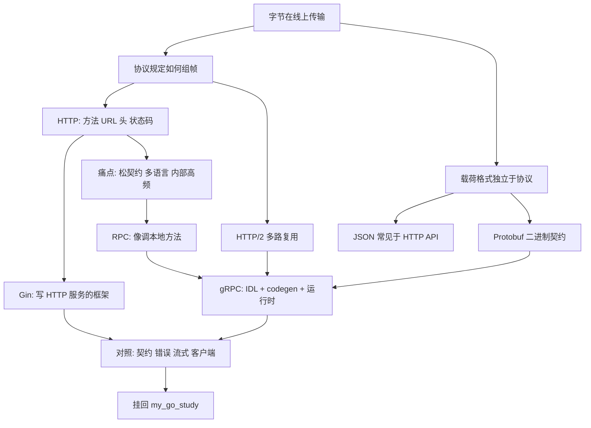
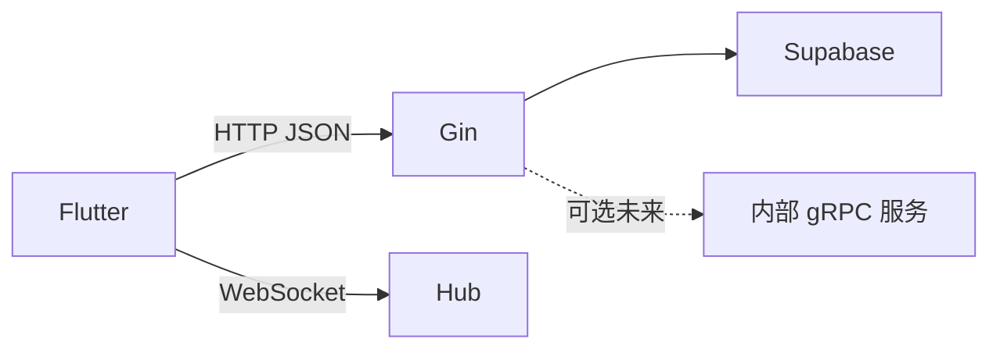

# Gin HTTP 与 gRPC 对比（小白完整版）

> 面向 `my_go_study`（Gin BFF）读者：把「协议 / 框架 / 载荷 / RPC」拆开，再对照本仓库该怎么选。  
> 更新日期：2026-09-17

---

## 0. 一句话结论

| | Gin + HTTP | gRPC |
|--|------------|------|
| 本质 | **HTTP 协议** + **Gin 框架**（常配 JSON） | **完整 RPC 体系**（IDL + 代码生成 + 运行时） |
| 更适合 | Flutter / 浏览器 / curl 等人要调试的客户端 | 服务与服务之间的强契约、高频调用 |
| 本仓库 | ✅ 正在用（`:8080` JSON API + WebSocket Realtime） | ❌ 未接入（无 `.proto`、无 `google.golang.org/grpc`） |

**压缩心智模型：**

1. 跨机器通信最终都是在 **传字节**  
2. **协议**管怎么组帧；**载荷格式**管正文怎么编码——两层可分开选  
3. **Gin 路** = HTTP + 框架 + 常配 JSON → 给人用的大门  
4. **gRPC 路** = RPC 模型 + `.proto`/codegen + 默认 Protobuf + 默认 HTTP/2 → 给机器用的电话  
5. 本仓库只开了大门；若将来加 gRPC，更合理的位置通常是 **BFF 后面的服务间**，而不是逼 Flutter 换协议  

---

## 1. 依赖图（怎么长出来的）



下面按节点展开；每一节都能从上一节推出来，不必死背对照表。

---

## 2. 根基三件套

### 2.1 字节在线上传输

两台电脑要交流，最终只能 **发送和接收字节**。没有「直接共享内存对象」这种事；对象必须先变成字节，对方再还原。

> **所有**跨机器通信，都是通过 **发送字节** 完成的。

HTTP、WebSocket、gRPC 的差别，不在「传不传字节」，而在 **怎么组织、怎么解释这些字节**。

### 2.2 协议 = 怎么组帧

**协议**是双方事先约定：字节怎么切分、头在哪、一条消息何时结束、控制信息怎么表示。

可以把协议想成「信封规则」：没有约定，对方收到的只是乱码。

### 2.3 载荷格式独立于协议

**载荷格式**（JSON、Protobuf、纯文本、图片字节…）只回答：业务正文怎么编码。

它和「用什么协议组帧」是两件可分开选择的事：

| 组合 | 是否合法 |
|------|----------|
| HTTP + JSON | ✅ 本仓库典型 |
| HTTP + Protobuf | ✅ 合法，只是少见一些 |
| gRPC 默认：HTTP/2 + Protobuf | ✅ 标准路径 |
| 「HTTP = JSON」「gRPC = 二进制」焊死成定律 | ❌ 混淆了协议与载荷 |

```text
[ 协议负责 ]              [ 载荷负责 ]
  长度/分隔/头/流 ID   +   JSON 或 Protobuf 正文
```

---

## 3. HTTP 与 Gin

### 3.1 HTTP 是什么

HTTP 是一种规定了 **方法、目标（URL）、头、状态码、可选正文** 的请求–响应协议。

人们发明它，是因为做网页/API 时反复需要同一类信息：

| 需求 | HTTP 里的位置 |
|------|----------------|
| 我想干什么？ | 方法：`GET` / `POST` / … |
| 对哪个资源？ | URL：`/api/v1/user/login` |
| 附加元数据？ | Header：`Authorization`、`Content-Type`、`X-Session-ID`… |
| 结果成没成？ | 状态码：`200` / `401` / `500`… |
| 正文？ | Body（可选；常放 JSON） |

重要澄清：

- HTTP **不**强制 Body 必须是 JSON  
- HTTP **不等于** REST（REST 只是一种在 HTTP 上常见的设计风格）  
- 你可以用 HTTP 写出完全非 REST 的 API  

本仓库一次登录（概念上）：

```text
客户端                          服务端 (Gin :8080)
   |  POST /api/v1/user/login
   |  Headers: Content-Type: application/json, ...
   |  Body: {"email":"...","password":"..."}
   | --------------------------------------->
   |  200 OK
   |  Body: {"token":"...","session_id":"..."}
   | <---------------------------------------
```

### 3.2 Gin 是什么

Gin（`github.com/gin-gonic/gin`）是 Go 的 **HTTP Web 框架**，跑在 `net/http` 之上，帮你做：

- 路由（`GET /api/v1/...`）  
- 中间件链（鉴权、日志、CORS）  
- JSON 绑定与响应辅助  

```text
Internet / client
        │
        ▼
   HTTP protocol
        │
        ▼
   Go net/http
        │
        ▼
 Gin (router / middleware / JSON)
        │
        ▼
  your handler code
```

**Gin 不是协议。** 线上仍是 HTTP。  
HTTP/1.1 还是 HTTP/2，由 Go 的 `http.Server` / TLS 配置决定，不是「用了 Gin 就等于 gRPC」。

口语里说「Gin HTTP vs gRPC」容易听成两个平级协议——实际上一边是 **协议上的框架**，一边是 **整套 RPC 体系**，层级不同。

### 3.3 为什么 HTTP API 常配 JSON

JSON：人能读、语言支持广、curl/Postman/浏览器 Network 好调试。

代价：相对更大、解析相对慢、字段可多可少——契约常靠文档/约定，而不是编译器强制。

这对 **Flutter ↔ BFF** 通常是优点，不是缺点。

---

## 4. 为何还要 gRPC：痛点 → RPC → 落地

### 4.1 痛点从哪来

当公司里有很多 **内部服务**（Go / Java / Python 互调、每天海量调用）时，纯 HTTP+JSON 容易撞上：

1. **契约太松**：少字段、类型漂移，运行期才炸  
2. **文档易飘**：URL/JSON 靠 Wiki，两边各写 client，对不齐  
3. **机器对机器**：没人需要「可读 JSON」，更在意小、快、类型稳  
4. **想要「调函数」的感觉**：`GetUser(id)`，而不是每次拼 URL + 手解析  
5. **流式**：持续推数据时，不想每次重套一整套「新的 HTTP 请求语义」，或不想另起一套自定义 WS 协议  

> 这些痛点主要砸在 **服务与服务之间**。  
> Flutter ↔ Gin BFF 要好调试、好对接时，Gin+JSON 往往更合适。痛点 ≠「对外也必须换」。

### 4.2 RPC 模型

RPC（Remote Procedure Call）是一种 **API 风格/模型**：按 **服务 + 方法 + 参数/返回值** 表达远程能力。

你以为的：

```text
user := GetUser("uuid-123")
```

实际发生的：

```text
参数 → 字节 → 网上传过去 → 服务端执行 → 结果 → 字节传回来
```

| | 典型 HTTP/Gin API | 典型 RPC |
|--|-------------------|----------|
| 你想的单位 | 资源与动作：`POST /api/v1/user/login` | 方法：`UserService.Login(req)` |
| 契约常落在 | URL + JSON 形状 + 文档 | 接口定义（IDL）+ 生成代码 |
| 调用感受 | 发请求、收响应 | 调函数、拿返回值（失败则是 RPC 错误） |

两者底层都可以是「请求–响应 + 字节」；差在 **怎么命名能力、怎么约束形状、工具链帮你做什么**。

RPC **不是**「不经过字节的魔法」，也 **不** 与 HTTP 物理互斥（gRPC 默认就跑在 HTTP/2 上）。

### 4.3 gRPC 如何落地

gRPC 把 RPC 想法打成一套标准工具链：

| 层 | gRPC 怎么做 |
|----|-------------|
| 契约 | `.proto` 当 source of truth |
| 工具 | `protoc` 等生成 Go/Dart/… 的 server/client 桩代码 |
| 调用 | `UserService.Login(ctx, req)` |
| 载荷 | 默认 **Protobuf** 二进制帧（带长度前缀等） |
| 传输 | 默认 **HTTP/2**；路径常像 `/包名.服务名/方法名` |
| 错误 | **gRPC status**（常在 HTTP/2 **trailers**；HTTP 层常仍是 200） |
| 流式 | 一元 / 服务端流 / 客户端流 / 双向流 |
| 横切逻辑 | Interceptor（类似 Gin middleware） |
| 超时/取消 | 常绑在 `context` 的 deadline/cancellation 上，可沿调用链传播 |

```text
Gin 路线:   你设计 URL/JSON  →  Gin 帮你路由/中间件 → HTTP
gRPC 路线:  你写 .proto     →  生成桩代码 + 运行时  → HTTP/2 + Protobuf
```

一次一元调用（概念图）：

```text
client                              gRPC server
   Login(req)  ──HTTP/2 + Protobuf──►  执行 Login
           ◄── Protobuf + grpc-status──  返回 / 错误
```

#### Protobuf（载荷 + 契约零件）

- `.proto` 描述消息字段（带 **字段编号**）和 `service` / `rpc`  
- 二进制，一般比同等 JSON 更小、解析更快  
- **Protobuf ≠ gRPC**：Protobuf 也能用在文件、消息队列、甚至普通 HTTP body；gRPC **默认选用** 它  

演进惯例：靠 field number 保持兼容；优先加字段、弃用字段；避免复用编号或随意改类型。

#### HTTP/2（默认传输零件）

- 一条连接上多路复用多个调用、有流控  
- **HTTP/2 ≠ gRPC**：很多 HTTPS 网站的 REST/JSON 也跑在 HTTP/2 上  

---

## 5. 并排对照表

| 维度 | Gin + HTTP（本仓库典型） | gRPC |
|------|---------------------------|------|
| 是什么 | HTTP **协议** + Gin **框架** | 完整 **RPC 体系** |
| API 表达 | URL + 方法：`POST /api/v1/user/login` | 服务.方法：`UserService/Login` |
| 契约 | 文档 / OpenAPI / 约定 | `.proto` + 生成代码 |
| 载荷 | 常为 JSON | 默认 Protobuf |
| 传输 | HTTP/1.1 或 HTTP/2 | 标准路径要求 HTTP/2 |
| 错误 | HTTP 状态码 + 可选 JSON body | gRPC status（常在 trailers；HTTP 常仍 200） |
| 流式 | chunked / SSE / **WebSocket**（本仓库 Realtime） | 四种 streaming 内建 |
| 横切逻辑 | Middleware | Interceptor |
| 超时/取消 | 可做；取消沿链路传播不如 gRPC/`context` 统一 | deadline/cancellation 一等公民 |
| 浏览器 | `fetch` 原生友好 | 标准 gRPC 不行；要 **gRPC-Web + 代理** |
| Flutter | `http` + JSON，路径最短 | 可用 gRPC+protobuf，但有生成管线与调试成本 |
| 调试 | curl、Postman、浏览器 Network | `grpcurl`、Buf、reflection；不如 JSON 直观 |
| 性能直觉 | 瓶颈常在 DB/网络；JSON 开销在小 CRUD 上常可忽略 | 内部高 QPS、大消息时优势更明显 |
| 版本演进 | `/v1`、兼容字段 | field number；加字段、弃用 |

### 五个常见误解

| 误解 | 纠正 |
|------|------|
| Gin 是 gRPC 的替代协议 | 层级不同：框架 vs RPC 栈 |
| REST = HTTP | REST 是设计风格；HTTP 上也可以非 REST |
| 开了 HTTP/2 就是 gRPC | HTTP/2 只是传输；REST/JSON 也能用 h2 |
| gRPC = 更快的 JSON HTTP | 还有契约、codegen、RPC 语义、默认 Protobuf |
| 有间接 `protobuf` 依赖就是支持 gRPC | 本仓库 `go.mod` 里 protobuf 是间接依赖；无 gRPC 服务 |

---

## 6. 挂回 `my_go_study`

### 6.1 当前架构

```text
Flutter (my_ai_project)
    │  HTTP JSON（登录/交易/资料…）
    │  WebSocket（Realtime）
    ▼
Go BFF  Gin :8080   ← 本仓库（无 gRPC）
    │
    ├─ Auth / PostgREST / …
    └─ Redis（session、ticket、Hub）
         ▼
    Supabase 等
```

### 6.2 由此推出的结论

1. **对外给 Flutter：Gin + HTTP + JSON 是匹配的**  
   移动端调试、Header（`Authorization` / `X-Session-ID` / `X-Device-ID`）、`curl`、联调文档，都站在 HTTP 这一边。

2. **仓库里没有 gRPC**  
   无 `.proto`、无 `google.golang.org/grpc`。

3. **Realtime 已是 WebSocket，不是「缺 gRPC streaming」**  
   Hub / ticket / Redis 是自有协议。换成 gRPC streaming = 重做客户端、鉴权与联调，不是升级开关。

4. **若将来出现 gRPC，更合理的位置通常是 BFF 后面**  



5. **同进程可以并存**  
   一个 Go 进程既听 `:8080` HTTP，再听另一个端口的 gRPC，并不互斥；当前只是没接这一路。

### 6.3 怎么选（实用规则）

| 选 Gin + HTTP/JSON 当 | 选 gRPC 当 |
|----------------------|------------|
| 主消费者是 Flutter / Web | 主消费者是内部微服务 |
| 要 curl/Postman/浏览器调试 | 要强类型契约 + 多语言 codegen |
| BFF 聚合/改造数据给客户端 | 高吞吐机器调用、统一 streaming RPC |
| 团队小，JSON + 文档够用 | 已有 mesh / 多团队共享 `.proto` |

**对本仓库的建议：** 继续把 Flutter 大门留在 Gin；只有出现清晰的「服务间」需求时，再在 BFF 之后引入 gRPC。

---

## 7. 自测题（可选）

1. Gin 和 gRPC 是同一层级的东西吗？  
2. HTTP/2 是否等于正在用 gRPC？  
3. Protobuf 能否离开 gRPC 单独使用？  
4. 为什么本仓库的 Realtime 换成 gRPC streaming 不是「改个配置」？  
5. 若要引入 gRPC，更合理的落点在 Flutter 侧还是 BFF 之后？

参考答案：1) 否（框架 vs RPC 栈）；2) 否；3) 能；4) 协议/鉴权/Hub/客户端全套不同；5) 通常 BFF 之后的服务间。

---

## 8. 相关文档

| 文档 | 用途 |
|------|------|
| [analytics-flutter-trial.md](./analytics-flutter-trial.md) | 数据分析列表/详情 gRPC 联调 |
| [architecture-learning-guide.md](../architecture-learning-guide.md) | 本仓库分层与时序 |
| [realtime-websocket.md](../realtime-websocket.md) | WS 协议（对比 gRPC streaming 时用） |
| [FEISHU_SYNC.md](../FEISHU_SYNC.md) | 本文如何同步到飞书 |
| [AGENTS.md](../../AGENTS.md) | Agent / 工程约束 |
