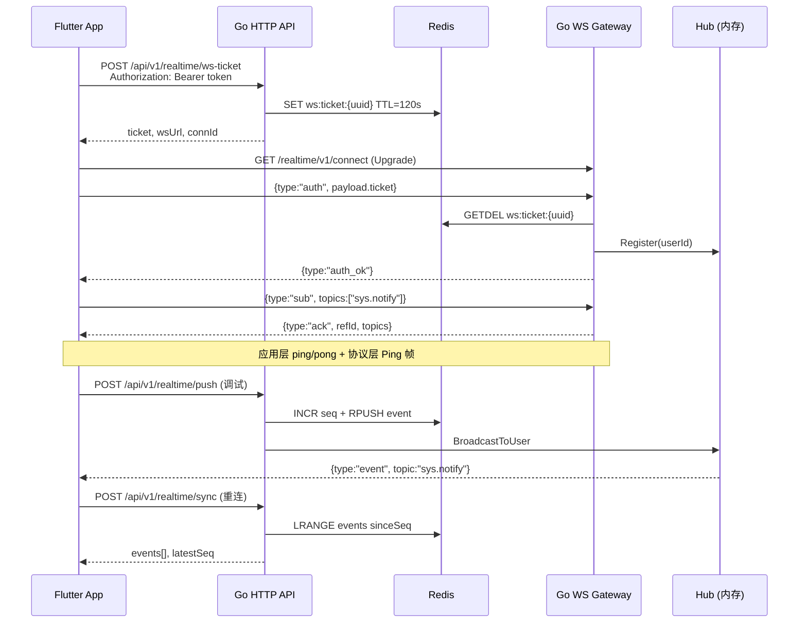
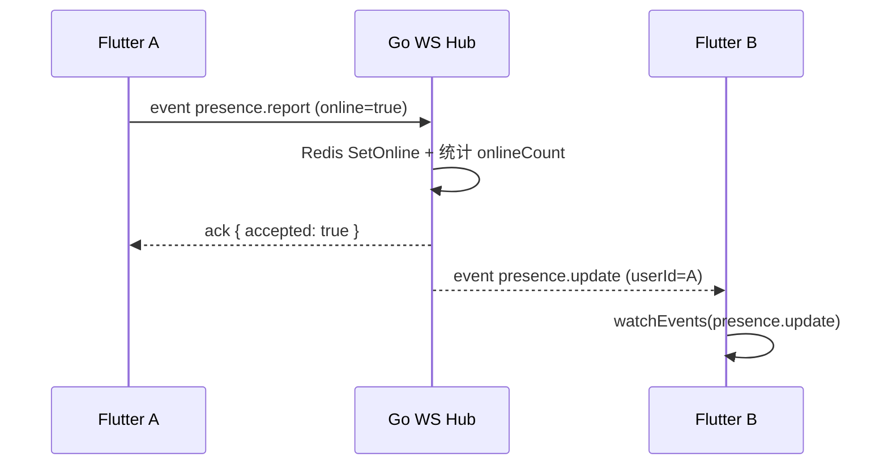
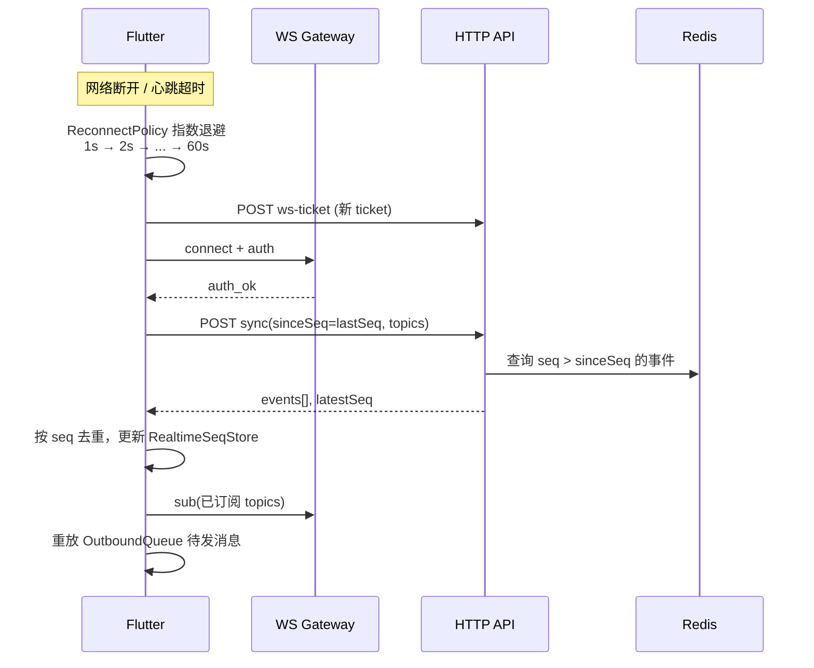

# Realtime WebSocket 协议与联调指南

本文档描述 **Go BFF WebSocket 网关** 与 **Flutter `module_realtime`** 之间的完整协议，包括连接鉴权、订阅、收发消息、心跳保活、断线重连与增量同步。

**相关项目**

| 项目 | 路径 | 角色 |
|------|------|------|
| Go 后端 | `my_go_study` | Ticket 签发、WS 网关、事件存储与广播 |
| Flutter 客户端 | `my_ai_project` | `AppRealtimeClient` 连接、心跳、订阅、UI 展示 |

> **初学者**：建议先读 [Realtime 初学者逐行导读](./realtime-beginner-walkthrough.md)，再查阅本文协议细节。

**前置条件**

- Go 后端已启动（`make run`），且 Supabase 已配置（`configs/supabase.env`）
- Redis 已运行（Ticket 与事件序列存储）
- 客户端持有有效的 **Supabase access_token**（登录后获得）

---

## 1. 架构总览



**设计要点**

1. **HTTP 鉴权 + WS 换票**：WebSocket 升级本身不带 JWT，先用 Supabase token 换一次性 `ticket`，再在 WS 首帧 `auth` 中消费。
2. **Topic 订阅**：服务端只向「已订阅对应 topic」的连接推送 `event`。
3. **Seq 增量同步**：每个用户独立单调递增 `seq`，断线后通过 HTTP `sync` 补拉遗漏事件。
4. **双重心跳**：应用层 JSON `ping/pong`（Flutter 主动）+ WebSocket 协议层 `Ping` 帧（Go 服务端主动）。

---

## 2. HTTP 接口

所有 Realtime HTTP 接口挂在 `/api/v1/realtime/*`，需 **Supabase JWT**：

```http
Authorization: Bearer <supabase_access_token>
Content-Type: application/json
```

响应为 **直接 JSON**（无 `ResultModel` 信封）。错误格式：`{"error":"..."}`。

### 2.1 换票 — `POST /api/v1/realtime/ws-ticket`

签发 WebSocket 连接票据，存入 Redis，**一次性消费**，默认 TTL **120 秒**。

**请求体**

| 字段 | 类型 | 必填 | 说明 |
|------|------|------|------|
| `platform` | string | 否 | 客户端平台，如 `mobile` / `web` |
| `connId` | string | 否 | 连接标识；省略时服务端生成 `conn_{毫秒时间戳}` |

**响应体**

| 字段 | 类型 | 说明 |
|------|------|------|
| `ticket` | string | UUID，WS `auth` 时提交 |
| `wsUrl` | string | WebSocket 地址，如 `ws://127.0.0.1:8080/realtime/v1/connect` |
| `expiresInSeconds` | int | 票据有效期（秒） |
| `connId` | string | 连接 ID（请求传入或服务端生成） |

**curl 示例**

```bash
# 先登录拿 token（或使用 SUPABASE_ACCESS_TOKEN）
TOKEN=$(curl -sf -X POST http://127.0.0.1:8080/api/v1/user/login \
  -H "Content-Type: application/json" \
  -d '{"username":"your@email.com","password":"yourpass"}' \
  | python3 -c "import sys,json; print(json.load(sys.stdin)['data']['token'])")

curl -s -X POST http://127.0.0.1:8080/api/v1/realtime/ws-ticket \
  -H "Authorization: Bearer $TOKEN" \
  -H "Content-Type: application/json" \
  -d '{"platform":"mobile"}' | python3 -m json.tool
```

**响应示例**

```json
{
  "ticket": "585899e9-71af-4c19-b76e-a352fa61d740",
  "wsUrl": "ws://127.0.0.1:8080/realtime/v1/connect",
  "expiresInSeconds": 120,
  "connId": "conn_1783568640999"
}
```

---

### 2.2 增量同步 — `POST /api/v1/realtime/sync`

断线重连后，拉取 `sinceSeq` 之后的历史事件（用于补发离线期间的消息）。

**请求体**

| 字段 | 类型 | 必填 | 说明 |
|------|------|------|------|
| `sinceSeq` | int64 | 是 | 客户端已处理的最大 seq（首次传 `0`） |
| `topics` | string[] | 否 | 只同步指定 topic；空数组 = 不过滤 |

**响应体**

| 字段 | 类型 | 说明 |
|------|------|------|
| `events` | RealtimeEnvelope[] | `seq > sinceSeq` 的事件列表 |
| `latestSeq` | int64 | 当前用户最大 seq |

**curl 示例**

```bash
curl -s -X POST http://127.0.0.1:8080/api/v1/realtime/sync \
  -H "Authorization: Bearer $TOKEN" \
  -H "Content-Type: application/json" \
  -d '{"sinceSeq":0,"topics":["sys.notify"]}' | python3 -m json.tool
```

**响应示例**

```json
{
  "events": [
    {
      "id": "evt_1783568642089",
      "type": "event",
      "topic": "sys.notify",
      "ts": 1783568642089,
      "seq": 1,
      "payload": {
        "name": "sys.notify.show",
        "notifyId": "8cf11287-4fd8-47fa-8a30-31c9bdeb5981",
        "title": "联调通知",
        "body": "来自 scripts/test_realtime_ws.sh"
      }
    }
  ],
  "latestSeq": 1
}
```

---

### 2.3 推送调试 — `POST /api/v1/realtime/push`

开发环境向指定用户推送 `event`（写入 Redis + 实时广播到已订阅的 WS 连接）。

**请求体**

| 字段 | 类型 | 必填 | 说明 |
|------|------|------|------|
| `userId` | string | 否 | 目标用户 UUID；省略 = 当前登录用户 |
| `topic` | string | 否 | 默认 `sys.notify` |
| `title` | string | 否 | 通知标题 |
| `body` | string | 否 | 通知正文 |
| `name` | string | 否 | 事件名，默认 `sys.notify.show` |
| `extra` | object | 否 | 附加字段，合并进 `payload` |

**响应体**

| 字段 | 类型 | 说明 |
|------|------|------|
| `envelope` | RealtimeEnvelope | 完整事件包络 |
| `delivered` | int | 实时送达的 WS 连接数（需目标连接已 `sub` 对应 topic） |

**curl 示例**

```bash
curl -s -X POST http://127.0.0.1:8080/api/v1/realtime/push \
  -H "Authorization: Bearer $TOKEN" \
  -H "Content-Type: application/json" \
  -d '{"title":"测试通知","body":"Hello from curl"}' | python3 -m json.tool
```

**响应示例**

```json
{
  "envelope": {
    "id": "evt_1783568642089",
    "type": "event",
    "topic": "sys.notify",
    "ts": 1783568642089,
    "seq": 1,
    "payload": {
      "name": "sys.notify.show",
      "notifyId": "8cf11287-4fd8-47fa-8a30-31c9bdeb5981",
      "title": "测试通知",
      "body": "Hello from curl"
    }
  },
  "delivered": 1
}
```

> `delivered: 0` 表示用户当前无已订阅 `sys.notify` 的在线连接，但事件仍会写入 Redis，重连后 `sync` 可补拉。

---

## 3. WebSocket 连接

### 3.1 端点

| 配置项 | 默认值 | 说明 |
|--------|--------|------|
| `realtime.ws_path` | `/realtime/v1/connect` | WS 路径 |
| `realtime.public_ws_host` | `127.0.0.1` | 返回给客户端的 WS 主机名 |

完整地址示例：`ws://127.0.0.1:8080/realtime/v1/connect`

- **升级请求无需 Authorization 头**
- `CheckOrigin` 当前为允许所有来源（开发模式）
- 生产环境建议配置反向代理与 `wss://`

### 3.2 连接时序（完整流程）

```
1. POST /api/v1/realtime/ws-ticket     → 获得 ticket + wsUrl
2. WebSocket.connect(wsUrl)              → TCP + Upgrade
3. 发送首条消息 { type: "auth", ... }    → 必须在 ticket 过期前完成
4. 收到 { type: "auth_ok" }              → 连接就绪
5. 发送 { type: "sub", topics: [...] }   → 订阅感兴趣的 topic
6. 收到 { type: "ack" }                  → 确认当前订阅列表
7. （可选）HTTP sync 补拉历史事件
8. 进入心跳循环 + 等待 event 推送
```

### 3.3 消息包络 — `RealtimeEnvelope`

Go 与 Flutter 使用相同 JSON 结构：

```json
{
  "id": "可选，消息唯一标识，用于 ping/pong 关联与 ack.refId",
  "type": "消息类型，见下表",
  "topic": "仅 event 类型需要，pub/sub 主题",
  "ts": 1739000000000,
  "seq": 1,
  "payload": {}
}
```

| 字段 | 类型 | 说明 |
|------|------|------|
| `id` | string? | 客户端生成；服务端 pong 会回显 ping 的 id |
| `type` | string | 见 §4 消息类型表 |
| `topic` | string? | `event` 的发布主题 |
| `ts` | int64? | 毫秒时间戳 |
| `seq` | int64? | 用户级单调递增序号（仅 `event`） |
| `payload` | object? | 各类型自定义字段 |

**单条消息上限**：64 KiB。

---

## 4. 消息类型详解

### 4.1 类型总表

| type | 方向 | 说明 |
|------|------|------|
| `auth` | 客户端 → 服务端 | WS 首帧，提交 ticket |
| `auth_ok` | 服务端 → 客户端 | 鉴权成功 |
| `sub` | 客户端 → 服务端 | 订阅 topic 列表 |
| `unsub` | 客户端 → 服务端 | 取消订阅 |
| `ack` | 服务端 → 客户端 | 确认 sub/unsub/客户端 event |
| `ping` | 客户端 → 服务端 | 应用层心跳 |
| `pong` | 服务端 → 客户端 | 应用层心跳响应 |
| `event` | 双向 | 业务事件（服务端推送为主） |
| `error` | 服务端 → 客户端 | 错误通知（通常紧接 WS 关闭） |

---

### 4.2 `auth` — WebSocket 鉴权

连接建立后 **第一条** 必须发送的消息。

**客户端 → 服务端**

```json
{
  "id": "auth_1",
  "type": "auth",
  "ts": 1739000000000,
  "payload": {
    "ticket": "585899e9-71af-4c19-b76e-a352fa61d740",
    "connId": "conn_1783568640999",
    "platform": "mobile"
  }
}
```

| payload 字段 | 必填 | 说明 |
|--------------|------|------|
| `ticket` | 是 | `ws-ticket` 接口返回的 UUID |
| `connId` | 否 | 与 ticket 响应中的 connId 对齐 |
| `platform` | 否 | 平台标识 |

**服务端 → 客户端（成功）**

```json
{
  "id": "auth_ok_1739000000123",
  "type": "auth_ok",
  "ts": 1739000000123,
  "payload": {
    "userId": "275d3060-849b-4ff6-a67d-b9dd3c5c9524",
    "sessionId": "a1b2c3d4-e5f6-7890-abcd-ef1234567890",
    "serverTime": 1739000000123
  }
}
```

**服务端 → 客户端（失败）**

```json
{
  "type": "error",
  "ts": 1739000000123,
  "payload": {
    "code": 4003,
    "message": "ticket 无效或已过期"
  }
}
```

随后 WebSocket 关闭，关闭码见 §7。

---

### 4.3 `sub` / `unsub` — 主题订阅

**订阅**

```json
{
  "id": "sub_1",
  "type": "sub",
  "ts": 1739000001000,
  "payload": {
    "topics": ["sys.notify", "presence.bulk"]
  }
}
```

**取消订阅**

```json
{
  "id": "unsub_1",
  "type": "unsub",
  "ts": 1739000002000,
  "payload": {
    "topics": ["presence.bulk"]
  }
}
```

**服务端 ack 响应**

```json
{
  "id": "ack_1739000001001",
  "type": "ack",
  "ts": 1739000001001,
  "payload": {
    "refId": "sub_1",
    "topics": ["sys.notify", "presence.bulk"]
  }
}
```

`payload.topics` 返回 **当前完整订阅列表**（非增量）。

#### 内置 Topic

| Topic 常量 | 值 | 典型事件名 | 说明 |
|------------|-----|-----------|------|
| `TopicSysNotify` | `sys.notify` | `sys.notify.show` | 全局系统通知 Banner |
| `TopicPresenceBulk` | `presence.bulk` | `presence.report` | 在线状态批量上报 |

Flutter 还定义了扩展 topic（如 `live.signal.{roomId}`），服务端 Hub 按字符串匹配，无白名单限制。

> **重要**：`push` 或广播只会送达 **已 `sub` 对应 topic** 的连接。未订阅则 `delivered: 0`。

---

### 4.4 `ping` / `pong` — 应用层心跳

Flutter 客户端主动发送，Go 服务端立即响应。

**客户端 → 服务端**

```json
{
  "id": "ping_1739000003000",
  "type": "ping",
  "ts": 1739000003000
}
```

**服务端 → 客户端**

```json
{
  "id": "ping_1739000003000",
  "type": "pong",
  "ts": 1739000003001
}
```

`pong.id` **必须** 与 `ping.id` 相同，客户端据此判断 RTT 与超时。

#### Flutter 心跳策略

| 参数 | 值 | 配置位置 |
|------|-----|----------|
| 发送间隔 | 25s | `RealtimeConfig.heartbeatInterval` |
| 单次超时 | 10s | `RealtimeConfig.heartbeatTimeout` |
| 最大连续丢失 | 2 次 | `RealtimeConfig.heartbeatMaxMiss` |

流程：

1. `auth_ok` 后启动 `HeartbeatScheduler`
2. 每 25s 发送 `ping`，记录 `pendingPingId`
3. 收到匹配 id 的 `pong` → 重置 miss 计数
4. 10s 内未收到 pong → miss+1；连续 2 次 miss → 判定连接丢失，触发重连

#### Go 协议层心跳（独立于应用层）

| 参数 | 值 | 代码位置 |
|------|-----|----------|
| 读超时 `pongWait` | 60s | `internal/delivery/ws/client.go` |
| 协议 Ping 间隔 | 54s | `pingPeriod = pongWait * 9/10` |
| 写超时 `writeWait` | 10s | 同上 |

服务端 `writePump` 每 54s 发送 WebSocket **协议 Ping 帧**（非 JSON）；`readPump` 在收到协议 Pong 后刷新 60s 读 deadline。

> 注意：`configs/config.yaml` 中的 `heartbeat_interval_seconds: 25` 目前 **未接入** Go 运行时，实际间隔见上表硬编码值。

---

### 4.5 `event` — 业务事件

服务端推送，或客户端上行 `presence.report`（Go 处理后广播 `presence.update`）。

**服务端 → 客户端（sys.notify 示例）**

```json
{
  "id": "evt_1739000004000",
  "type": "event",
  "topic": "sys.notify",
  "ts": 1739000004000,
  "seq": 3,
  "payload": {
    "name": "sys.notify.show",
    "notifyId": "660e8400-e29b-41d4-a716-446655440001",
    "title": "新消息",
    "body": "你有一条系统通知"
  }
}
```

| payload 字段 | 说明 |
|--------------|------|
| `name` | 事件名，Flutter 按此路由到 Handler |
| `notifyId` | 去重 ID（服务端 UUID） |
| `title` / `body` | 通知展示文案 |
| `category` | 消息分类：`scheduled` / `promotion` / `reminder` / `system` |
| `priority` | `low` / `normal` / `high` |
| `campaignId` | 批次 ID，如 `hourly-20260710-11` |
| `scheduleSlot` | 计划槽位 ISO8601 |
| `messageType` | 细分类，如 `hourly_digest` |
| `expiresAt` | 毫秒过期时间 |
| `action` | 点击行为 `{ type, route, params, url }` |
| `metadata` | 埋点/运营透传 |
| 其他 | 通过 `push.extra` 或业务扩展 |

定时每小时通知完整示例见 [message-queue.md](./message-queue.md#定时每小时系统通知)。

**客户端 → 服务端（presence.report，Flutter 上报在线状态）**

```json
{
  "id": "evt_client_1",
  "type": "event",
  "topic": "presence.bulk",
  "ts": 1739000005000,
  "payload": {
    "name": "presence.report",
    "online": true,
    "device": "ios"
  }
}
```

**服务端 ack**

```json
{
  "id": "ack_1739000005001",
  "type": "ack",
  "ts": 1739000005001,
  "payload": {
    "refId": "evt_client_1",
    "accepted": true
  }
}
```

**服务端 → 其他客户端（presence.update 广播，排除发送者）**

Go `RealtimePresenceUsecase` 收到 `presence.report` 后：
1. 更新 Redis 在线集合 `presence:online`
2. 向所有订阅 `presence.bulk` 的连接广播（不含上报者）

```json
{
  "id": "evt_presence_1739000005100",
  "type": "event",
  "topic": "presence.bulk",
  "ts": 1739000005100,
  "payload": {
    "name": "presence.update",
    "userId": "275d3060-849b-4ff6-a67d-b9dd3c5c9524",
    "online": true,
    "onlineCount": 3,
    "device": "ios"
  }
}
```



**Flutter 发送示例**

```dart
await client.sendEvent(
  topic: RealtimeTopics.presenceBulk,
  eventName: 'presence.report',
  payload: {'online': true, 'device': 'ios'},
);

client.watchEvents(eventName: 'presence.update').listen((e) {
  print('${e.payload['userId']} online=${e.payload['online']}');
});
```

调试页：**设置 → Realtime 调试 → 上报 presence.report**，底部会显示收到的 `presence.update`。

> 其他 topic 的上行 `event` 仍仅回 `ack`，不广播。扩展方式：在 `handler.go` 的 `handleEvent` 增加分支或注入新 usecase。

#### Flutter 事件处理 — `sys.notify.show`

```
event (topic=sys.notify, name=sys.notify.show)
  → GlobalNotifyHandler
  → NotifyDedupStore（按 notifyId 去重，最多 200 条）
  → RealtimeNotifyBannerController
  → 顶部 Banner UI
```

调试入口：**设置 → Realtime / WebSocket 调试**（仅 Debug 模式可见）。

---

### 4.6 `error` — 错误

```json
{
  "type": "error",
  "ts": 1739000006000,
  "payload": {
    "code": 4001,
    "message": "missing ticket"
  }
}
```

通常紧接 WebSocket 关闭，客户端应进入重连流程。

---

## 5. 断线重连与增量同步



| 步骤 | 说明 |
|------|------|
| 1. 换票 + 重连 | 每次重连必须重新 `ws-ticket`（旧 ticket 已消费或过期） |
| 2. HTTP sync | 拉取断线期间遗漏的 `event` |
| 3. seq 去重 | `RealtimeSeqStore.acceptSeq()` 跳过 `seq <= lastSeq` |
| 4. 重订阅 | 发送 `sub` 恢复 topic 列表 |
| 5. 出站重放 | SQLite `OutboundQueueManager` 重发未 ack 的客户端消息 |

**Flutter 重连参数**

| 参数 | 值 |
|------|-----|
| 初始间隔 | 1s |
| 最大间隔 | 60s |
| 倍数 | 2x |
| 抖动 | ±20% |

---

## 6. Redis 存储

### 6.1 WS Ticket

| 项 | 值 |
|----|-----|
| Key | `ws:ticket:{ticket_uuid}` |
| Value | `{"userId","connId","platform"}` |
| TTL | `ticket_ttl_seconds`（默认 120s） |
| 消费 | `GETDEL`（原子读取并删除，一次性） |

### 6.2 用户事件流

| 项 | 值 |
|----|-----|
| Seq 计数器 | `realtime:seq:{userId}` — `INCR` |
| 事件列表 | `realtime:events:{userId}` — `RPUSH` + `LTRIM` |
| 保留条数 | `event_retention`（默认 200） |

---

## 7. WebSocket 关闭码

与 Flutter `RealtimeConfig` 对齐：

| 码 | 常量 | 触发场景 |
|----|------|----------|
| 4001 | `WSCloseAuthFailed` | `auth` 缺少 ticket |
| 4002 | `WSCloseKicked` | 预留（当前未实现踢人） |
| 4003 | `WSCloseTicketExpired` | ticket 无效、已使用或过期 |

---

## 8. Flutter 客户端接入

### 8.1 配置

| 配置 | 位置 | 当前值 |
|------|------|--------|
| `useMockGateway` | `realtime_config.dart` | `false`（连真实 Go WS） |
| `ticketPath` | 同上 | `/api/v1/realtime/ws-ticket` |
| `syncPath` | 同上 | `/api/v1/realtime/sync` |
| `wsBaseUrl`（参考） | `env_config.dart` | `ws://127.0.0.1:8080/realtime/v1/connect` |
| 模拟器映射 | `backend_ws_config.dart` | `127.0.0.1` → `10.0.2.2` |

> 实际连接地址以 `ws-ticket` 返回的 `wsUrl` 为准，再经 `BackendWsConfig.resolveWsUrl()` 做平台映射。

### 8.2 自动连接时机

`RealtimeInitializer` 在以下情况尝试 `connect()`：

- 隐私协议已同意 + 已登录
- 登录成功 / 环境切换
- App 从后台恢复（非手动断开时）
- 网络恢复（`connectivity_plus`）

默认自动订阅：`sys.notify`、`presence.bulk`。

### 8.3 代码示例

**监听连接状态**

```dart
final client = Get.find<AppRealtimeClient>();
client.connectionState.listen((state) {
  debugPrint('WS: ${state.label}'); // 已连接 / 重连中 / ...
});
```

**订阅并监听 topic 事件**

```dart
await client.subscribeTopics([RealtimeTopics.sysNotify]);

client.watchTopic(RealtimeTopics.sysNotify).listen((envelope) {
  debugPrint('${envelope.eventName} seq=${envelope.seq}');
});
```

**按事件名监听**

```dart
client.watchEvents(eventName: 'sys.notify.show').listen((e) {
  final title = e.payload['title'];
  final body = e.payload['body'];
});
```

**发送客户端事件（presence 示例）**

```dart
await client.sendEvent(
  topic: RealtimeTopics.presenceBulk,
  eventName: 'presence.report',
  payload: {'status': 'online'},
);
```

**直播房示例**（见 `live_room_page.dart`）

```dart
final roomId = 'room_001';
await client.subscribeTopics([
  RealtimeTopics.liveSignal(roomId),
  RealtimeTopics.liveRoomState(roomId),
]);

client.watchTopic(RealtimeTopics.liveSignal(roomId)).listen((e) {
  // live.join / live.seat_changed ...
});
```

### 8.4 调试页面

路径：`/settings/realtime_debug`（Debug 模式 → 设置 → **Realtime / WebSocket 调试**）

显示：连接状态、lastSeq、重连次数、队列深度等。

操作：手动连接/断开、订阅 `sys.notify`、模拟 presence 事件。

---

## 9. 联调与测试

### 9.1 一键联调脚本

```bash
cd my_go_study
make run          # 终端 1：启动服务
make test-realtime # 终端 2：全流程联调
```

脚本 `scripts/test_realtime_ws.sh` 覆盖：

1. health 检查
2. 登录（或 `SUPABASE_ACCESS_TOKEN` / service_role 自动建用户）
3. ws-ticket
4. push 通知
5. sync 增量
6. WebSocket auth 单元测试（`TestWSAuthFlowLive`）

### 9.2 手动 WebSocket 调试（Python）

```bash
pip install websocket-client  # 一次性

python3 <<'PY'
import json, os, urllib.request, websocket

BASE = "http://127.0.0.1:8080"
TOKEN = os.environ["TOKEN"]  # export TOKEN=eyJ...

# 1. 换票
req = urllib.request.Request(
    f"{BASE}/api/v1/realtime/ws-ticket",
    data=json.dumps({"platform": "cli"}).encode(),
    headers={"Authorization": f"Bearer {TOKEN}", "Content-Type": "application/json"},
    method="POST",
)
ticket_data = json.loads(urllib.request.urlopen(req).read())
ticket = ticket_data["ticket"]
ws_url = ticket_data["wsUrl"]
print("ticket:", ticket, "ws:", ws_url)

# 2. 连接 + auth + sub
def on_message(ws, msg):
    print("<<", msg)
    env = json.loads(msg)
    if env["type"] == "auth_ok":
        ws.send(json.dumps({
            "id": "sub_1", "type": "sub", "ts": 0,
            "payload": {"topics": ["sys.notify"]},
        }))
    elif env["type"] == "ack":
        print("subscribed:", env["payload"].get("topics"))

ws = websocket.WebSocketApp(
    ws_url,
    on_message=on_message,
    on_open=lambda w: w.send(json.dumps({
        "id": "auth_1", "type": "auth", "ts": 0,
        "payload": {"ticket": ticket, "platform": "cli"},
    })),
)
ws.run_forever()
PY
```

另开终端推送：

```bash
curl -X POST http://127.0.0.1:8080/api/v1/realtime/push \
  -H "Authorization: Bearer $TOKEN" \
  -H "Content-Type: application/json" \
  -d '{"title":"手动测试","body":"WS 应收到 event"}'
```

### 9.3 Flutter 端验证清单

| 步骤 | 期望结果 |
|------|----------|
| `flutter run --dart-define-from-file=.env` | 启动成功 |
| 登录真实账号 | 获取 Supabase token |
| 设置 → Realtime 调试 | 状态 `已连接` |
| 执行 `push` curl | App 顶部 Banner 弹出通知 |
| 切换飞行模式 10s 后恢复 | 自动重连，sync 补拉 |
| 登出 | WS 断开 |

---

## 10. 常见问题

| 现象 | 原因 | 处理 |
|------|------|------|
| `未授权` (401) | token 过期或缺失 | 重新登录；检查 `Authorization` 头 |
| `ticket 无效或已过期` (4003) | ticket 超时（120s）或重复使用 | 重新 `ws-ticket` 后再 `auth` |
| `delivered: 0` | 客户端未 `sub` 对应 topic 或不在线 | 确认已订阅；事件仍可通过 `sync` 补拉 |
| Android 模拟器连不上 WS | `127.0.0.1` 指向模拟器自身 | Flutter 自动映射 `10.0.2.2`；Go 返回的 `wsUrl` 也会被 remap |
| 心跳超时频繁重连 | 网络不稳定或 Go 服务阻塞 | 检查 Redis、Go 日志；确认 8080 无多实例 |
| `make test-realtime` 登录失败 | 默认 `demo@example.com` 未注册 | 配置 `.env.local` 的 service_role（脚本自动建用户）或设 `SUPABASE_ACCESS_TOKEN` |

---

## 11. 源码索引

### Go 后端

| 文件 | 说明 |
|------|------|
| `internal/domain/entity/realtime_envelope.go` | 包络结构、Topic 常量、关闭码 |
| `internal/delivery/http/controller/realtime_controller.go` | HTTP 控制器 |
| `internal/delivery/http/router/realtime_routes.go` | 路由注册 |
| `internal/delivery/ws/handler.go` | WS 消息分发（auth/sub/ping） |
| `internal/delivery/ws/client.go` | 心跳、读写 pump |
| `internal/delivery/ws/hub.go` | 用户级广播 |
| `internal/usecase/realtime_presence_usecase.go` | presence.report → presence.update |
| `internal/repository/redis/presence_repo.go` | 在线状态 Redis |
| `internal/repository/redis/ws_ticket_repo.go` | Ticket Redis 仓储 |
| `internal/repository/redis/realtime_event_repo.go` | 事件 Redis 仓储 |
| `scripts/test_realtime_ws.sh` | 联调脚本 |

### Flutter 客户端

| 文件 | 说明 |
|------|------|
| `packages/commons/core/lib/model/realtime/realtime_envelope.dart` | 包络模型 |
| `packages/infrastructure/realtime/lib/client/app_realtime_client_impl.dart` | 核心客户端 |
| `packages/infrastructure/realtime/lib/connection/heartbeat_scheduler.dart` | 应用层心跳 |
| `packages/infrastructure/realtime/lib/api/ws_ticket_api.dart` | 换票 HTTP |
| `packages/infrastructure/realtime/lib/api/ws_sync_api.dart` | 同步 HTTP |
| `packages/infrastructure/realtime/lib/handlers/global_notify_handler.dart` | 通知 Banner |
| `packages/infrastructure/realtime/lib/debug/realtime_debug_page.dart` | 调试页 |
| `packages/commons/network/lib/http/backend_ws_config.dart` | WS URL 平台映射 |

---

## 12. 已知限制（MVP）

| 项 | 状态 |
|----|------|
| `max_connections_per_user: 3` | 配置存在，**未强制** |
| `WSCloseKicked (4002)` | 常量已定义，**未实现**踢人逻辑 |
| `heartbeat_interval_seconds` (YAML) | **未接入** Go 运行时，实际用 `client.go` 硬编码 |
| 客户端上行 `event` 广播 | ✅ `presence.report`；其他 topic 仅 `ack` |
| 生产 `wss://` | 需反向代理（Nginx/Caddy）终止 TLS |
