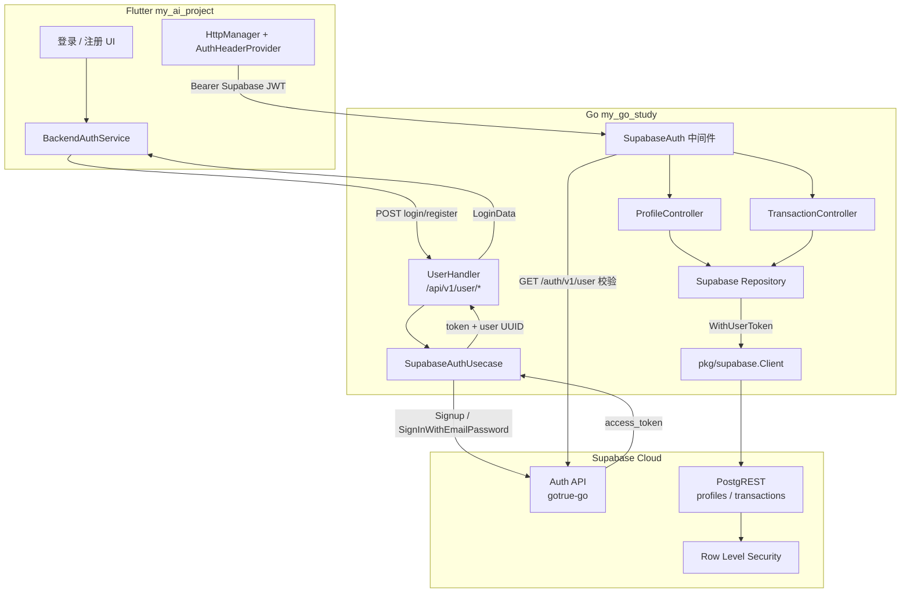

# my_go_study 与 Supabase 集成说明

本文档描述 Go 后端如何与 Supabase 交互，以及与 Flutter 客户端 `my_ai_project` 的协作方式。

**相关仓库**

| 项目 | 路径 | 说明 |
|------|------|------|
| Go 后端 | `my_go_study` | Gin + Clean Architecture，Supabase 认证与数据代理 |
| Flutter 客户端 | `my_ai_project` | 邮箱密码登录走 Go 后端，业务数据走 Go 代理 Supabase |

**共用 Supabase Project**：Go 侧见 `configs/supabase.env`，Flutter 侧见 `.env`，两者 `URL` / `ANON_KEY` 须一致。

---

## 1. 架构总览

系统采用 **「Flutter → Go 后端 → Supabase」** 模式：客户端不直接调用 Supabase Auth，由 Go 后端统一代理认证与数据访问。



### 1.1 两套认证体系（重要）

| 路由组 | 认证方式 | Token 来源 | 用户标识 | 用途 |
|--------|----------|------------|----------|------|
| `/api/v1/user/login`、`/register` | 无（公开） | — | — | 邮箱密码注册/登录，返回 **Supabase access token** |
| `/api/v1/me/*`、`/api/v1/transactions*`、`/api/v1/profiles/*` | `SupabaseAuth` 中间件 | Supabase JWT | UUID 字符串 | Profile、Transactions 等业务数据 |
| `/api/v1/user/list`、`/api/v1/user/profile` | `Auth` 中间件（自建 JWT） | Go 签发的 JWT | `uint` 本地用户 ID | **遗留接口**，与当前 Supabase 登录不兼容 |

> **Flutter 当前路径**：登录拿 Supabase token → 业务请求带同一 token 访问 `/api/v1/me/profile`、`/api/v1/transactions`。不要对 `/api/v1/user/profile` 使用 Supabase token。

### 1.2 本地 PostgreSQL 的角色

`my_go_study` 仍连接本地 PostgreSQL（用户表 `users`、GORM AutoMigrate）。在 Supabase 认证模式下：

- **注册/登录**不再写入本地 `users` 表
- 本地库主要用于历史自建用户体系与 `TransactionRecord` 等本地实体（若启用）
- Supabase 侧 `profiles`、`transactions` 表由 PostgREST 访问

---

## 2. 配置与启用条件

### 2.1 环境变量

团队共用常量写入 **`configs/supabase.env`**（入库）；`service_role` 仅 **`.env.local`**。

```bash
cp .env.example .env
cp .env.local.example .env.local
```

| 变量 | 文件 |
|------|------|
| `SUPABASE_URL` | `configs/supabase.env` |
| `SUPABASE_ANON_KEY` | `configs/supabase.env` |
| `SUPABASE_SERVICE_ROLE_KEY` | `.env.local`（推荐） |

`config.SupabaseConfig.Enabled()` 在 `URL` 与 `AnonKey` 均非空时返回 `true`，此时 `main.go` 会初始化全部 Supabase 组件。

### 2.2 配置加载顺序

1. `configs/config.yaml`（基础）
2. `configs/config.{APP_ENV}.yaml`（如 `config.dev.yaml`）
3. 环境变量覆盖（见 `pkg/config/config.go` 的 `BindEnv`）

### 2.3 客户端角色

`pkg/supabase.Client` 持有两个 Supabase Go 客户端：

| 字段 | API Key | 用途 |
|------|---------|------|
| `Anon` | `SUPABASE_ANON_KEY` | 用户注册/登录（gotrue-go）、`WithUserToken` 访问 PostgREST（配合 RLS） |
| `Admin` | `SUPABASE_SERVICE_ROLE_KEY`（缺省回退 anon） | `EmailRegistered` 等管理端查询 |

```go
// pkg/supabase/client.go
func (c *Client) WithUserToken(accessToken string) (*sb.Client, error)
```

Repository 层每次请求用当前用户的 access token 创建客户端，使 PostgREST 以 `authenticated` 角色执行，RLS 策略生效。

---

## 3. 认证流程（邮箱 + 密码）

### 3.1 注册

```
Flutter BackendAuthService.signUpWithEmail
  → POST /api/v1/user/register { username, password, email }
  → UserHandler.Register
  → SupabaseAuthUsecase.Register
  → gotrue: Anon.Auth.Signup
  → 返回 AuthUserItem（id 为 UUID）或 LoginData（含 token）
```

**关键文件**

| 层级 | 文件 |
|------|------|
| HTTP | `internal/delivery/http/handler/user_handler.go` |
| 用例 | `internal/usecase/supabase_auth_usecase.go` |
| 客户端 | `pkg/supabase/client.go` |
| 响应 DTO | `internal/delivery/http/dto/response/user.go` → `AuthUserItem`, `LoginData` |

**注册响应两种情况**

1. Supabase 开启邮箱确认：无 `token`，返回用户信息 + 错误码提示「请查收验证邮件」
2. 关闭邮箱确认：直接返回 `LoginData { token, user }`

Flutter `BackendAuthService` 在无 session 时会尝试自动 `signInWithEmail`。

### 3.2 登录

```
Flutter signInWithEmail
  → POST /api/v1/user/login { username: email, password }
  → SupabaseAuthUsecase.Login
  → gotrue: Anon.Auth.SignInWithEmailPassword
  → LoginData { token: access_token, user: { id: UUID, ... } }
```

**请求约定**：`username` 字段传 **邮箱地址**（须含 `@`），不是本地 users 表的用户名。

### 3.3 错误映射

Go 用例层错误 → HTTP 响应 → Flutter `AuthFailure`：

| Go 错误 | HTTP | message 关键词 | Flutter Failure |
|---------|------|----------------|-----------------|
| `ErrInvalidParams` | 400 | 参数错误 | `InvalidParamsFailure` |
| `ErrUserExists` | 400 | 用户已存在 | `EmailAlreadyRegisteredFailure` |
| `ErrAccountNotRegistered` | 404 | 账号未注册 | `AccountNotRegisteredFailure` |
| `ErrInvalidCredentials` | 401 | 密码错误 | `InvalidCredentialsFailure` |
| `ErrEmailConfirmationRequired` | 400 | 验证邮件 | `EmailConfirmationRequiredFailure` |
| `ErrSupabaseUnavailable` | 502 | 无法连接 Supabase | `UnknownAuthFailure` |

`ErrAccountNotRegistered` 仅在配置了 `SUPABASE_SERVICE_ROLE_KEY` 时可用：`refineInvalidCredentials` 通过 Admin API 查邮箱是否已注册。

### 3.4 Token 校验（受保护路由）

`middleware.SupabaseAuth` 流程：

1. 从 `Authorization: Bearer <token>` 提取 access token
2. 调用 `GET {SUPABASE_URL}/auth/v1/user`（`pkg/auth/supabase.go`）
3. 解析用户 `id`（UUID）、`email`
4. 写入 Gin 上下文：`supabaseUser`、`accessToken`
5. Controller / Repository 使用上下文中的 token 访问 PostgREST

---

## 4. 业务数据：Profile 与 Transactions

### 4.1 数据访问模式

```
Controller → Usecase → Supabase Repository
  → client.WithUserToken(accessToken)
  → PostgREST: From("profiles").Select(...).Eq("id", userID)
```

| 表 | Entity | Repository | 用户隔离 |
|----|--------|------------|----------|
| `profiles` | `entity.Profile` | `internal/repository/supabase/profile_repo.go` | `id = auth.uid()` |
| `transactions` | `entity.Transaction` | `internal/repository/supabase/transaction_repo.go` | `user_id = 当前用户` + RLS |

Transactions 仓储 **强制** 在查询中加 `.Eq("user_id", userID)`，与 Supabase RLS 形成双层防护。

### 4.2 API 路由（两套格式）

**Flutter 兼容**（snake_case，部分直出 JSON）：

| 方法 | 路径 | 说明 |
|------|------|------|
| GET/PATCH | `/api/v1/me/profile` | 个人资料 |
| GET/POST | `/api/v1/transactions` | 列表 / 创建 |
| GET/PUT/DELETE | `/api/v1/transactions/:id` | 单条 CRUD |

**统一管理**（`{ code, message, data }`，camelCase）：

| 方法 | 路径 | 说明 |
|------|------|------|
| GET/PATCH | `/api/v1/profiles/me` | 个人资料 |
| GET/POST | `/api/v1/transactions/manage` | 分页列表 / 创建 |
| GET/PUT/DELETE | `/api/v1/transactions/manage/:id` | 单条 CRUD |

路由注册见 `internal/delivery/http/router/profile_routes.go`、`transaction_routes.go`。

### 4.3 RLS 迁移（必做）

在 Supabase SQL Editor 执行：

- `supabase/migrations/003_transactions_user_id_rls.sql` — 启用 `transactions` RLS
- `supabase/migrations/004_fix_transactions_rls_policies.sql` — 修复策略（若需要）

验证：

```bash
./scripts/check_transactions_rls.sh
make test-transactions
```

未启用 RLS 时，若客户端绕过 Go 直连 PostgREST，可能读写他人数据。Go 层已过滤，但 RLS 是数据库层最后防线。

---

## 5. 依赖注入与启动

`cmd/api/main.go` 在 `cfg.Supabase.Enabled()` 时：

```go
sbClient, _ := pkgsb.New(cfg.Supabase)
supabaseAuthUC := usecase.NewSupabaseAuthUsecase(sbClient)
profileRepo := sbrepo.NewProfileRepository(sbClient)
transactionRepo := sbrepo.NewTransactionRepository(sbClient)
// → ProfileController、TransactionController
userHandler := handler.NewUserHandler(userUC, supabaseAuthUC)
```

`router.Setup` 根据 `Supabase.Enabled()` 挂载：

- `registerUserRoutes` — 始终注册
- `registerProfileRoutes` + `registerTransactionRoutes` — 仅 Supabase 启用时，共用 `middleware.SupabaseAuth`

---

## 6. Flutter 客户端协作

### 6.1 认证开关

`my_ai_project/.env`：

```env
USE_MOCK_AUTH=false   # true=本地 Mock；false=真实登录
```

`AuthSession.register()` 读取 `SupabaseConfig.useMockAuth`，`false` 时注册 `BackendAuthService`。

### 6.2 请求链路

```
登录: UserAuthApi → POST /api/v1/user/login → 持久化 token 到 UserService
业务: HttpManager + AuthHeaderProvider → Authorization: Bearer <Supabase JWT>
      → Go SupabaseAuth 中间件校验 → PostgREST
```

默认后端地址：`http://127.0.0.1:8080`（iOS 模拟器）；Android 模拟器常用 `http://10.0.2.2:8080`。

### 6.3 手机号登录

`BackendAuthService.sendPhoneOtp` / `verifyPhoneOtp` 当前抛出「短信登录暂未开放，请使用邮箱登录」。UI 可展示手机号入口，但后端未实现。

---

## 7. 目录与职责对照

```text
my_go_study/
├── cmd/api/main.go                          # 依赖注入入口
├── pkg/
│   ├── config/config.go                     # SupabaseConfig、Enabled()
│   ├── supabase/
│   │   ├── client.go                        # Anon / Admin / WithUserToken
│   │   ├── session.go                       # access token → gotrue Session
│   │   └── auth_admin.go                    # EmailRegistered（service_role）
│   └── auth/supabase.go                     # ValidateAccessToken
├── internal/
│   ├── usecase/
│   │   ├── supabase_auth_usecase.go         # 注册 / 登录
│   │   ├── profile_usecase.go
│   │   └── transaction_usecase.go
│   ├── repository/supabase/
│   │   ├── profile_repo.go
│   │   └── transaction_repo.go
│   └── delivery/http/
│       ├── handler/user_handler.go          # /user/login、/register
│       ├── middleware/
│       │   ├── supabase_auth.go             # Supabase JWT
│       │   └── auth.go                      # 自建 JWT（遗留）
│       ├── controller/                      # Profile / Transaction
│       └── router/                          # 按模块拆分路由
└── supabase/migrations/                     # RLS SQL 脚本
```

---

## 8. 联调与测试

### 8.1 启动后端

```bash
cd my_go_study
cp .env.example .env   # 填写 SUPABASE_* 
make deps-up         # 或 docker compose 启动 PG/Redis
make run
curl http://127.0.0.1:8080/health   # {"status":"ok"}
```

### 8.2 命令行验证登录

```bash
# 注册
curl -s -X POST http://127.0.0.1:8080/api/v1/user/register \
  -H "Content-Type: application/json" \
  -d '{"username":"demo","password":"123456","email":"demo@example.com"}'

# 登录（username 填邮箱）
curl -s -X POST http://127.0.0.1:8080/api/v1/user/login \
  -H "Content-Type: application/json" \
  -d '{"username":"demo@example.com","password":"123456"}'

# 使用返回的 token 访问 profile
TOKEN="<access_token>"
curl -s http://127.0.0.1:8080/api/v1/me/profile \
  -H "Authorization: Bearer $TOKEN"
```

### 8.3 Flutter 联调检查清单

- [ ] Go `/health` 正常
- [ ] `.env` 中 `USE_MOCK_AUTH=false`
- [ ] Go 与 Flutter 的 `SUPABASE_URL` / `SUPABASE_ANON_KEY` 一致
- [ ] Supabase Dashboard 邮箱确认策略与预期一致
- [ ] `transactions` RLS 已执行迁移脚本
- [ ] 登录后首页 / 记账接口返回 200（非 401）

### 8.4 单元测试

```bash
cd my_go_study
go test ./internal/usecase/ -run SupabaseAuth -v
go test ./pkg/auth/ -v
```

---

## 9. 常见问题

### Supabase 未配置，无法登录

日志无「Supabase 已启用」；`UserHandler` 返回 503。检查 `.env` 或 `config.dev.yaml` 中 `supabase.url` 与 `supabase.anon_key`。

### 登录成功但业务接口 401

- 确认请求头为 `Authorization: Bearer <token>`（Flutter `AuthHeaderProvider`）
- Token 是否过期（Supabase 默认约 1 小时，需重新登录）
- 是否误调用了需要自建 JWT 的 `/api/v1/user/profile`

### 密码错误 vs 账号未注册

未配置 `SUPABASE_SERVICE_ROLE_KEY` 时，两种错误都映射为「密码错误」。配置 service_role 后可区分。

### 端口 8080 被占用

```bash
lsof -i :8080
kill <PID>
make run
```

### 无法连接 Supabase（502）

检查网络、API Key 是否正确、Project 是否暂停。Go 映射为 `ErrSupabaseUnavailable`。

---

## 10. 扩展指南

### 新增 Supabase 表

1. 在 Supabase 建表并配置 RLS（`auth.uid()` 隔离）
2. `internal/domain/entity/` 定义实体与表名常量
3. `internal/domain/repository/` 定义接口
4. `internal/repository/supabase/` 实现（`WithUserToken` + PostgREST）
5. `internal/usecase/` 业务逻辑
6. `internal/delivery/http/controller/` + `router/` 注册路由，挂载 `SupabaseAuth` 中间件
7. `cmd/api/main.go` 注入依赖

### 新增认证方式（如手机号 OTP）

1. 在 `SupabaseAuthUsecase` 增加 OTP 方法（gotrue 相应 API）
2. `UserHandler` 增加路由或在现有 handler 扩展
3. Flutter `BackendAuthService` 实现 `sendPhoneOtp` / `verifyPhoneOtp`

---

## 11. 相关文档

- [启动指南](./startup-guide.md) — 环境、Makefile、Docker
- Flutter [AGENTS.md](../../../my_ai_project/AGENTS.md) — Agent 开发约定与认证分层
- [Supabase Auth 文档](https://supabase.com/docs/guides/auth)
- [Supabase RLS 文档](https://supabase.com/docs/guides/auth/row-level-security)
